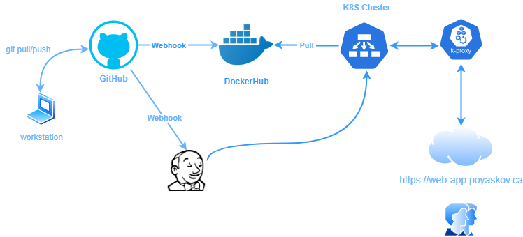

# Web-app Test deployment using Jenkins

We are building test web-application image using this Dockerfile and deploying it to the Kubernetes cluster with Jenkins.

Whole idea is to automate image building and deploy custom web-application to the Kubernetes cluster.




#### 1. Commit custom code to the GitHub/Bitbucket repo

Develop and check-in/commit your code to the repo: https://github.com/poyaskov/test-web-app.git


#### 2. Build Docker image based on gitHub repo

Configure webhook in the DockerHub to auto build web-server custom image once code is commited to the GitHub repo.

Here is DockerHub image location: [poyaskov/test-web-app](https://hub.docker.com/repository/docker/poyaskov/test-web-app)


#### 3. Create k8s deployment


Once new custom image has been built and pushed to the Image repo ( DockerHub), we need to deploy it to the Runtime ( Kubernetes Cluster).

Here is deployment-file which we need to run wit kubectl command: 

```
---
apiVersion: v1
kind: Service
metadata:
  name: test-web-app-svc
  labels:
    app: test-web-app
spec:
  type: NodePort
  ports:
   - port: 80
  selector:
   app: test-web-app

---
kind: PersistentVolumeClaim
apiVersion: v1
metadata:
   name: px-test-web-app
   annotations:
     volume.beta.kubernetes.io/storage-class: px-db-repl3-sc
spec:
   accessModes:
     - ReadWriteOnce
   resources:
     requests:
       storage: 1Gi
---
apiVersion: apps/v1
kind: Deployment
metadata:
  name: test-web-app
  labels:
    app: test-web-app
spec:
  replicas: 1
  selector:
    matchLabels:
      app: test-web-app
  template:
    metadata:
      labels:
        app: test-web-app
    spec:
      initContainers:
        - name: www-html-vol
          image: busybox
          command:
            - sh
            - '-c'
            - 'chown -R 33:33 /var/www'
          volumeMounts:
            - name: apachehome
              mountPath: /var/www/html
          imagePullPolicy: IfNotPresent
      imagePullSecrets:
        - name: regcred
      containers:
      - name: test-web-app
        image: poyaskov/test-web-app:latest
        imagePullPolicy: "Always"
        ports:
        - containerPort: 80
        volumeMounts: 
#        - name: apachehome
#          mountPath: /var/www/html
      volumes:
      - name: apachehome
        persistentVolumeClaim:
          claimName: px-test-web-app
```
